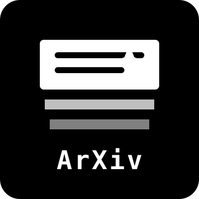

<div align="center">
  
  <h1>ArXivDigest</h1>
  <p><strong>AI-powered daily feed and semantic search for ArXiv research papers.</strong></p>
</div>

---

## 🚀 Overview

ArXivDigest is an automated pipeline and modern web application that makes it effortless to keep up with the latest AI/ML research. 

It automatically fetches newly published papers from ArXiv, uses local Large Language Models (DistilBART) to generate concise 2-sentence summaries, generates semantic embeddings (Cohere), and serves them through a sleek, fast web interface.

### 🌟 Key Features
* **Automated Daily Sync:** GitHub Actions cron job runs daily to fetch new papers.
* **AI Summarization:** Uses HuggingFace `transformers` (DistilBART) to compress long abstracts into bite-sized insights.
* **Hybrid Search:** Combines MongoDB exact keyword/author matching with Qdrant semantic vector search for incredibly accurate results.
* **Modern UI:** Built with React, Vite, and Tailwind CSS.
* **Decoupled Architecture:** Heavy ML processes run independently on GitHub Actions, keeping the production API extremely lightweight and fast.

## 🏗️ Architecture

The project is split into 3 distinct parts:

1. **The Data Pipeline (GitHub Actions & Python)**
   - `crawler.py`: Scrapes latest papers from ArXiv via OAI-PMH XML.
   - `summarizer.py`: Downloads DistilBART, generates summaries, embeds with Cohere, and pushes vectors to Qdrant.
   
2. **The Backend API (FastAPI)**
   - Serves the frontend via lightweight REST endpoints.
   - Connects to MongoDB Atlas (metadata) and Qdrant Cloud (vectors).
   - Only requires standard web dependencies (no heavy ML libraries required for production).

3. **The Frontend (React + Vite)**
   - Sleek, responsive grid UI.
   - Real-time hybrid search.

## 💻 Tech Stack

* **Frontend:** React, Vite, Tailwind CSS, Lucide Icons, React Router.
* **Backend:** FastAPI, Beanie (MongoDB ODM), Motor (Async Mongo), Qdrant Client.
* **Machine Learning:** PyTorch, Transformers, Cohere Embeddings.
* **Databases:** MongoDB Atlas (Document Store), Qdrant Cloud (Vector Database).
* **CI/CD:** GitHub Actions.

## 🛠️ Local Development

### Prerequisites
* Python 3.10+
* Node.js 18+
* MongoDB Atlas Cluster URI
* Qdrant Cloud URL & API Key
* Cohere API Key

### 1. Setup Backend
```bash
cd backend
python -m venv venv
source venv/bin/activate  # On Windows: venv\Scripts\activate

# Install API dependencies
pip install -r requirements.txt

# Install ML dependencies (only if you want to run the summarizer locally)
pip install -r requirements-ml.txt

# Set your environment variables
cp .env.example .env
# Edit .env with your real API keys

# Start the API server
uvicorn main:app --reload
```

### 2. Setup Frontend
```bash
cd frontend
npm install
npm run dev
```

## 🚀 Deployment Guide

This project is optimized for free-tier deployments:

1. **Frontend:** Deploy the `frontend/` folder directly to **Vercel**. Set the `VITE_API_URL` environment variable to your deployed backend URL.
2. **Backend API:** Deploy the `backend/` folder to **Render** or **Railway**. The build command is `pip install -r requirements.txt` and the start command is `uvicorn main:app --host 0.0.0.0 --port $PORT`. Ensure you set the MongoDB and Qdrant environment variables in the dashboard.
3. **The Pipeline:** The ML pipeline runs via GitHub Actions automatically. Just add your API keys (MongoDB, Cohere, Qdrant) to your repository's **Settings > Secrets**.

## 📄 License
MIT License
